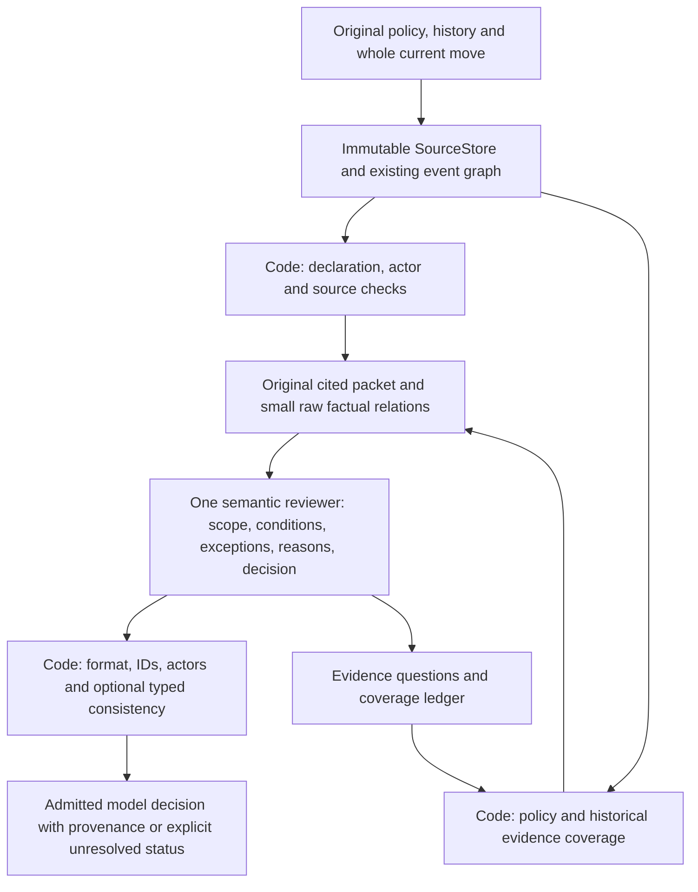

# Recommended minimal Guardian architecture and evidence

Recommend an original-source store, code that selects sources with explicit
coverage, and one source-grounded reviewer whose decision follows its reasons.
Keep structural/source checks and a small factual adapter. Do not make a
verdict-free norm compiler, contradiction reviewer or recursive planner a
mandatory stage. This is an engineering recommendation for the next isolated
prototype, not a demonstrated improvement on the full contest task.

New research used **34 inference attempts, 217722 known/charged tokens**, with no
retries or hidden input clipping. Eight Gemma failures were full JSON Markdown
fences; a separate zero-call format-contract diagnostic admits all eight.
Working recursion and flag-triggered semantic correction remain unmeasured.
The full known valid46 archived OR baseline still replays to TP20/FP2/FN3/TN21,
F1=0.8889. This phase has no comparable new overall valid46 score or independent
holdout. Sealed160 R0 F1=0.9714 belongs to a different synthetic dataset.

## Component decisions

| Component | Status | Evidence and boundary |
|---|---|---|
| Immutable SourceStore, offsets and original citations | SUPPORTED | Every prepared/final source span validates; Windows/server offline replay agree. Retain original text rather than replacing it with summaries. |
| Current whole-move inventory, actor/namespace admission | SUPPORTED | Prose bank negative and four-call positive preserved; six actor failures and one missing-policy reference are exposed. Admission cannot certify entailment and can reject a right raw label. |
| Existing declaration/receipt/typed identity checks | SUPPORTED | Native unique pairing, typed values and literal time checks remain generic. Latest polymorphic receipt or USER call does not prove assistant execution/current truth. Multi-call model misses 16 declared payment fields: retain structural checking. |
| One reviewer with decision-last and explicit binary-task contract | CONDITIONALLY_SUPPORTED | Mistral I2/I4 repair Telecom relative to I1; actual key order is respected. I3 introduces bank FP, bank I4 actor fails, Silver raw FP remains. Keep the interface, without claiming universal reliability. |
| Provider-specific format admission | CONDITIONALLY_SUPPORTED | Exactly-one-complete-fence offline contract recovers 8/8 Gemma replies with unchanged inner/source admission. Frozen strict predictions remain failures; future adapter must be separately tested/frozen. |
| Generic coverage-aware source selection | CONDITIONALLY_SUPPORTED | Eight code-selected reads find the early h10 receipt without runtime hardcoded ID and yield correct expiry cause. R0 uses eight norm-only reads and invents an absence violation. One original positive supports source coverage, not general recall. |
| Small code factual adapter | CONDITIONALLY_SUPPORTED | K1 fixes one bank actor admission; K2 has a cleaner Telecom auxiliary norm interpretation but adds bank uncertainty. No raw binary gain over I4; use facts as qualified raw relations, not semantic proof. |
| Independent search for missing obligations | CONDITIONALLY_SUPPORTED | Stage A misses the principal expiry FORBID; multicall reviewer misses payment schema errors despite source access. A second independent inventory could address recall, but its quality/cost is NOT_TESTED. Keep coverage tracking in the default; postpone mandatory extra LLM. |
| Stage A as compulsory executable norm inventory | REJECTED_FOR_NOW | Six typed rows omit the decisive Telecom norm and misuse condition bits. Both code aggregations UNKNOWN; a real positive becomes FN under UNKNOWN=0. This does not prove richer formalization impossible. |
| Separate model Stage B on every case | NOT_SUPPORTED | Both final labels correct and bank admission repaired, but 26433 tokens versus 11706 I4. B reinterprets originals rather than executes a faithful A proof. No measured raw binary gain; do not pay two calls by default. |
| C1 citation metadata reviewer / C2 old-verdict exposure | REJECTED_FOR_NOW | No new Telecom label repair; C1 adds bank uncertainty, C2 retains actor failure. C2 old ERROR cause is replaced with correct expiry cause, but C0 already has that cause. Metadata alone cannot certify a semantic conflict. |
| Recursive gap planner as default | NOT_TESTED | Its first plan uses declarations as selectable evidence and historical IDs as target IDs; strict namespace rejection precedes all reads. A working recursive search's causal benefit is not measured. Prefer measured simple coverage for this prototype. |
| Typed V1 consistency flag | SUPPORTED | Closed typed contradictions are detected in regressions without auto-flip. Actual eligible Telecom generates zero flags; normative truth/correction benefit NOT_TESTED. Use only as optional diagnostic. |
| V2 extra reviewer after flag | NOT_TESTED | Saved NO_TYPED_CONTRADICTION_FLAG skip, zero calls. No inference repair or false-warning rate on contradictory real typed replies measured. |
| V3 independently qualified prohibition proof | CONDITIONALLY_SUPPORTED | Offline source audit of scope/line/date/non-exemption yields ERROR; missing/model-self-declared qualification yields UNKNOWN. Oracle-assisted ceiling, not automatic grounding or universal solver. |
| Fail-fast after rejected/empty retrieval | SUPPORTED | Separate future guard has three regressions: invalid plan and search-only evidence cannot invoke a judge; valid full read still proves no label. Frozen R1's wasted empty-evidence final remains retained. |
| Durable provider-qualified budget, wire hashes and replay | SUPPORTED | 34 attempts are conserved across both providers; exact field order is part of the body identity. Unknown usage/reserved interrupts never retry; focused tests and raw integrity checks pass. |

## One proposed data flow

Code owns exact source text, event/current-target inventory, source namespaces,
chronology, generic declaration constraints, native receipt integrity, typed
literal comparisons and budget/admission. LLM owns normative meaning, activating
conditions, semantic role/alias selection, permissions/exceptions and the
source-grounded current-move decision. A valid model judgment remains an opinion,
not automatically a code proof. Human/oracle qualification is never silently
replaced by a model boolean.

Controller tools are read-only: catalog, `read_source`, `search_sources`,
`lookup_entity`, co-recorded `neighbors`, declaration/source edges, original
quote expansion and bounded prior-event navigation. Examined business tools
cannot execute. Graph edges mean co-recorded source relations, not ownership,
permission or applicability. One-shot coverage is the default; retain original
fact/call/result/source topology and exact offsets without rebuilding the graph.

Evidence memory stores original source references, complete-read coverage,
current target bindings, typed raw facts and a gap ledger. Each gap keeps its
originating policy, question, target, required fact, candidate/visited/supporting
sources and unresolved reason. Navigation summaries or episode titles cannot
replace quoted proof. Resolved model gaps stay MODEL_HYPOTHESIS until reviewed.

Repeat read/search only for a specific uncovered evidence question, through
code-selected candidates and original expansions. Do not repeatedly ask a model
to restate its previous answer. Extra LLM is optional only for a real source
ambiguity, admitted typed conflict or separately approved missing-obligation
inventory. The present experiments do not justify making any extra pass routine.
Reject an invalid plan before review; search-only/no full evidence is technical
non-admission, not a negative label. A repaired planner requires a separately
frozen protocol, not a retry in this completed phase.

ERROR may finish when one actual current violation is source-grounded, with its
applicability and applicable exception considered. A narrow code ERROR is allowed
only for declared structural proof or independently qualified supported norm
type. Model ERROR requires original source entailment, not merely present IDs;
R0 shows why a right label can still be a wrong accusation. Distinguish the
contest's attempted current move from an unobserved completed side effect.

NO_ERROR requires adequate applicable-policy/current-move/evidence coverage and
no established violation; a missed principal norm makes a negative unsafe. An
incomplete retrieval does not inherit full-journal absence guarantees. Missing
state/identity/norm interpretation produces semantic UNKNOWN with specific
questions. Complete-journal absence of a mandatory prior same-entity procedure
may prove a violation only after scope/process semantics are independently
established. Technical rejection or budget/context stop has null semantic label.
The declared contest projection UNKNOWN=0 is a reporting choice that can create
FN; it never makes UNKNOWN a proved compliant state.

Prototype bounds: at most eight distinct complete reads, at most two gap updates,
no repeat-read loop, one primary model call plus at most one explicitly justified
extra review, no automatic transport retry. These are proposed engineering caps,
not empirically optimized constants. Preflight full request/schema/output budget;
switch explicitly to indexed access if it cannot fit, or stop with a context
reason. Keep pending-call reservations durable; record actual usage and latency.
Hard call/token/deadline limits terminate remaining questions as unresolved,
without inventing sufficiency. No population latency/F1 promise follows from
the observed 233.417 summed provider seconds.

## Long context evidence

`long_context_access_audit.json` compares full original availability, compact
indexed catalogs and existing graph/episode navigation offline on the real rows.
The largest valid46 input is banking080: 233104 prompt characters and 368172
prompt+response UTF8 bytes, with 97 history events. There is no new full-context
inference versus graph inference quality comparison; those effects are NOT_TESTED.

For Telecom the decisive h10 receipt precedes 24 later history events and current
t0. Generic current operand lookup returns the original line record and its
co-recorded entity neighbors through existing SourceStore; no h10 ID is supplied
to that lookup. Eight-source coverage subsequently reads its complete original
span. Norm-only catalog selection loses it. This establishes useful cross-event
navigation availability, not a universal episode-memory system or proof that
all long trajectories fit the same read cap. No summaries were substituted for
originals, and no complete-input accuracy was inferred from selected sources.

## Answers to the fifteen required questions

1. Old A/C contain NO_ERROR directly in raw JSON while explaining the actual
   expiry violation. Raw-to-admitted-to-saved equality excludes label inversion
   in Python. New I1 instead invents a no-executed-harm exemption, so not every
   wrong negative is a pure label flip. Internal generation cause remains a
   hypothesis; factorial data support local interface sensitivity.
2. Explicit labels fix Telecom I3 versus I1, but create bank I3 false accusation
   by treating a data request as completed verification. Universal repair is
   disproved by this paired negative.
3. Actual decision-last ordering is honored. I2/I4 recover Telecom and bank raw
   labels; bank actor failures prevent full strict two-case success. One sample
   per cell gives local evidence, not a statistically robust general effect.
4. Separate A/B yields correct final labels on two cases and fixes bank actor
   admission, at more than twice the tokens. Typed A misses the main ban;
   code aggregation UNKNOWN on the positive causes FN. No reason to mandate it.
5. Gemma's strict pipeline fails formatting in all eight cells. Exact fenced
   diagnostic has all correct core causes/labels and actual order respected;
   the banking I3 answer still has a peripheral source-attribution caveat.
   it does not repeat Ministral's semantic error on these two cases. Provider
   decoding modes differ; no broad model-superiority inference is warranted.
6. K1 fixes one actor admission, not a raw binary mistake. K2 reduces one auxiliary
   Telecom scope error but creates unsupported banking uncertainty. Blanket
   factual inventories are not proven beneficial.
7. C1/C2 give no new correct Telecom cause or label relative to C0. C1 adds bank
   uncertainty. C2 changes old wrong historical cause while retaining old ERROR;
   a correct label agreement cannot distinguish anchoring from source reasoning.
8. Code automatically derives raw source/actor/currentness metadata without fixed
   IDs. It cannot prove the prior judge's semantic accusation false when that
   schema has no claimed per-citation actor/target relation. True automatic
   conflict grounding remains unmeasured.
9. R1 mentions h10 as a candidate but retrieves zero sources because its plan
   fails namespace validation. Autonomous iterative retrieval success is not
   established. Candidate mention is not evidence discovery.
10. Code coverage retrieves the early record and correct expiry cause using
    eight reads and one 6103-token judgment. R0 norm-only final is 7018 tokens
    with wrong cause; R1 technically blocked. Working recursion superiority
    remains NOT_TESTED, so it cannot justify extra default complexity.
11. V1 detects closed typed mismatches in regressions and never auto-flips. Actual
    real inputs flag zero; V2 is skipped. A/C prose would require semantic
    normalization, which is another hypothesis pass, not a code-certified fix.
12. Wrong stage/scope semantics remain: bank verification request becomes executed
    verification; business norms transfer to personal opening; informational
    Silver reply inherits database-change consent; multicall gets invented
    per-call consent; source-starved R0 invents absent actions. More graph depth
    alone cannot correct those mistakes.
13. Multicall positive's real one-call norm is detected but payment-field errors
    are missed and consent claims invented. Silver negative becomes raw FP plus
    actor failure. These controls do not establish robust interface transfer.
    A separately labelled offline banking081 explicit exception source audit
    exercises scope/actor boundaries, not model generalization. It supports a
    local four-request permission; a separate reason-code issue prevents
    certifying the entire move as compliant.
14. Retain original store/graph, declarations, actor inventory, native receipt
    guards, typed comparisons, exact quote expansion, coverage and durable
    budget/replay. Do not change production or historical branches.
15. Recommend the one-reviewer source-preserving coverage flow above. Defer
    compulsory norm compilation, old-opinion review, autonomous recursion and
    universal proof. Independently test missing-obligation recall on a new
    frozen holdout before claiming contest F1 improvement or any reliability
    target. Full Hybrid implementation remains outside this task.

## Research outcome

The main actionable finding is the separation of source discovery, semantic
interpretation, format/admission and label consistency. No new overall binary
F1 improvement has been demonstrated. Simpler coverage gives one additional
correct cause relative to source-starved retrieval; a typed norm pipeline can
miss that same cause. Correct sources, valid JSON and agreeable bits are useful
engineering boundaries, but insufficient accuracy guarantees.
