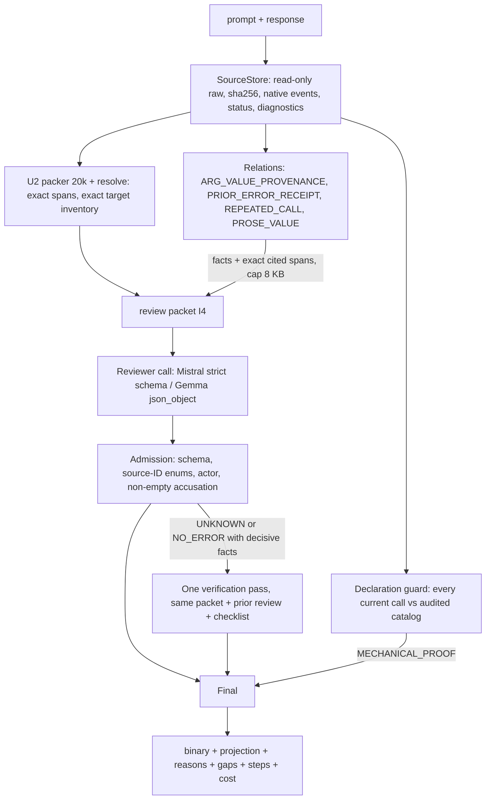

# Architecture: Guardian integrated v1

## Entry points
- Python: `guardian_truth.integrated.review(prompt, response, config=ReviewConfig(...), client=Transport(...)) -> dict`
- CLI: `guardian-review INPUT.json|jsonl --profile baseline|guard|relations|integrated --provider mistral|ollama [--offline|--no-model]`
- Profiles: `baseline` = A1; `guard` = A2; `relations` = A3 (without the controller); `integrated` = A4. Only `prompt`/`response` are read; extra keys (labels, ids) are ignored.

## Execution graph

## Data contracts and authority
| Object | Status | Authority |
|---|---|---|
| SourceStore spans | EXACT_SOURCE | Only exact address, actor and span. The text is untrusted data |
| Guard finding | MECHANICAL_PROOF | Declared field type/enum/required violations of a current call against a fully audited catalog. The only code-proven ERROR. Passing never certifies NO_ERROR |
| Relation fact | SOURCE_OBSERVATION | Exact string/status/identity relations over the full prompt. Not a violation, not applicability. Decisive facts only steer the controller trigger |
| Reviewer decision | MODEL_HYPOTHESIS | Admitted only with valid target/norm/evidence IDs and actor |
| Gaps | — | Parser diagnostics, packer `NOT_READ:*` (unread policy/history is not proof of absence), guard gaps, model open questions, relation truncation |

## Scope and completeness
- Every current target (`t*`) is enumerated in `checked_targets` and reaches the guard, even when the model packet is partial.
- The packet is budgeted at 20 000 bytes. `coverage.complete_input=false` tells the model that unread sources were not read.
- Relations scan the full prompt. "NOT_OBSERVED" means the exact string occurs in no earlier event; it does not mean the value is false. Case or substring variants are reported separately.
- NO_ERROR is never certified by code. UNKNOWN stays UNKNOWN in the ledger and projects to 0.

## Budgets and fallbacks
- Transport: one HTTP attempt per call. Exact-equivalence cache key (provider, endpoint, model, request, attempt). fsync'ed attempts ledger. Counters are rebuilt on restart. `max_calls`/`max_tokens_total` caps → `BUDGET_EXHAUSTED`. `offline=True` → `NetworkTripwire` on a cache miss.
- Controller: ≤1 extra call. It never runs after a technical failure. A rejected second pass → the first decision stands (`fallback_after`).
- No model client → `NOT_EXECUTED_PROJECTED_0` (the guard can still prove ERROR).

## Binary projection
`ERROR→1`. `NO_ERROR`, `UNKNOWN_PROJECTED_0`, `TECHNICAL_NULL_PROJECTED_0`, `SKIPPED_PROJECTED_0` and `NOT_EXECUTED_PROJECTED_0` → 0, each reported separately.
