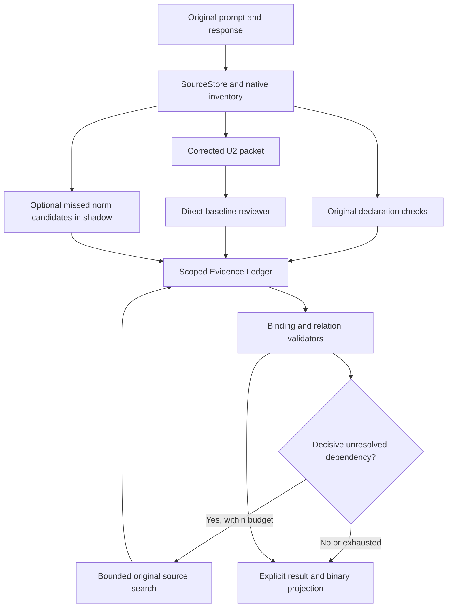

# GUARDIAN OF TRUTH — UNIVERSAL INTEGRATION, REPAIR AND VALIDATION

Дата постановки: 5 октября 2026 года. Репозиторий: https://github.com/MYC-A/Guardian-of-Truth.

## 0. Задача и свобода решений

Ты — автономный инженер и исследователь Guardian. Продолжи с фактического состояния проекта: исправь дефекты, согласуй контракты компонентов, объедини источники, проверки и управление исследованием в один воспроизводимый путь и экспериментально оцени получившийся детектор на исходной бинарной задаче.

Нужны работающий код, связанная архитектура, реальные прогоны, независимый аудит и опубликованные результаты. Не заканчивай работу одним планом, красивой схемой или успехом промежуточного JSON. Отрицательные результаты сохраняй и используй для выбора следующего шага.

Предложенная ниже архитектура — исходная гипотеза. Ты можешь менять её, интерфейсы, модели, порядок стадий, число вызовов и способ представления отношений, если обнаружишь проблему. Можно удалить лишнюю сложность из нового рабочего пути или заменить модуль более простым. Сохрани сравнимый baseline и обоснуй изменение: наблюдаемая ошибка → механизм → проверка → результат. Не пытайся подтвердить наши идеи любой ценой.

Под универсальностью понимается отсутствие зависимости от известных ID строк, названий бизнес-инструментов, доменов и эталонных объяснений. Новые правила, инструменты, поля, сущности и значения должны поступать из входа. Универсальность нельзя доказать несколькими переименованиями: явно описывай поддерживаемые форматы, семантический охват и границы. Для неподдержанного случая сохраняй неопределённость вместо выдуманного правила.

Разрешены работа в отдельной исследовательской ветке/worktree, обычные commit + push, локальные и SSH-проверки, доступные модели и исследование первичных научных источников. Не меняй production/main, не переписывай чужую историю, не применяй force-push, не удаляй исторические результаты и не редактируй замороженные gold/requests/raw. Публикация новой исследовательской ветки входит в задачу. Архитектурные решения внутри неё принимай самостоятельно.

## 1. Начни с актуального состояния, а не с названия checkout

```text
git status --short
git worktree list
git remote -v
git fetch origin
git branch -a --sort=-committerdate
git log --all --oneline -30
```

Прочитай применимые AGENTS.md. Не переключай грязный или занятый другим агентом worktree. Выбери основу после проверки ancestry и diff. Разумная проверенная отправная точка — `research/whole-move-v1-20261005`, SHA `8a9aa56dcd7e2ad3746a19f39161229cf9c1f97a`; её рабочая копия на этой машине: `C:\Users\Igor\Guardian-whole-move-v1-20261005`. Это снимок, не обещание, что он останется последним. Настоящий handoff находится в `research/integration-handoff-20261005`.

Создай новый worktree и ветку, например `research/guardian-integrated-v1-20261005`, от выбранного актуального коммита. Не делай массового merge всех исследований. Переноси конкретные проверенные изменения с указанием происхождения. Включение ветки в ancestry ещё не означает, что её контракт безопасен или её модуль подключён.

При аудите 05.10.2026 после fetch найдено 60 remote refs и 24 worktrees. Локальный modular checkout отставал от origin на 24 коммита, v11 policy-table — на 6, hybrid-assistants — на 1. Поэтому проверяй remote SHA и нужные blobs через git show, а не только открытые IDE-файлы. Полный снимок: `docs/integration_handoff_20261005/branch_inventory.json`.

Основная последовательность, уже входящая в указанную базу:

| Линия | Проверенный tip | Где читать |
|---|---|---|
| Semantic V4 | `f77e76c5` | `docs/research_v3/`, `experiments/research_v3/` — название v3 осталось историческим |
| Atomic V5 | `ba248421` | `docs/research_v5/`, `experiments/research_v5/`, binary/oracle audits |
| Telecom recovery | `6035918c` | `docs/telecom_causal_recovery/`, соответствующие experiments/outputs |
| Hybrid mechanisms | `f89d271b` | `docs/hybrid_mechanisms_v1/`, `experiments/hybrid_mechanisms/` |
| Retrieval bakeoff | `8e135f55` | `docs/retrieval_bakeoff_v1/` |
| Retrieval corrections | `49d887bd` | `docs/retrieval_corrections_v2/`, runtime freeze `8dfb7a06` |
| Whole move / compact | `8a9aa56d` | `docs/whole_move_v1/`, `docs/whole_move_compact_v2/` |

Дополнительно изучи `origin/research/universal-evidence-packer-20261004` (`daba0b39`), `origin/research/multipacket-gap-controller-v1-20261004` (`a7a113e7`), `origin/research/coverage-v2-facet-cover-20261004` (`98b7fd2b`). Coverage-v2 — отдельная боковая ветка; часть selector уже есть в базе, но не все её harness/docs/tests. Метаданные retrieval corrections исправлены отдельно; не возвращай прежние ошибки cherry-pick'ом старого selector.

Для старых проверяющих компонентов прочитай актуальные remote modular (`6135ae69`), v11 policy-table (`35ce9821`), consent audit (`64f48c5a`), prod admissibility (`1183409c`), source-search (`149d4cf0`), integration/system-research и hybrid-service. Они дают кандидатов для reuse и известные границы, а не разрешение считать все их выводы доказанными. В частности, доменный `resume_line` gate в `src/guardian_truth/checks.py` не подходит как универсальная бизнес-логика нового пути.

## 2. Зафиксируй, что уже известно и что не доказано

Обязательно прочитай:

- `docs/research_v5/BINARY_METHOD_AUDIT.md`, `ORACLE_PROCESS_RESULTS.md`, `FINAL_DECISION.md`, `RUNBOOK.md`.
- `docs/telecom_causal_recovery/FAILURE_ANALYSIS.md`, `SOURCE_PACKET_AUDIT.md`, `FINAL_DECISION.md`.
- `docs/hybrid_mechanisms_v1/`, `docs/retrieval_bakeoff_v1/CAUSAL_AUDIT.md` и `FINAL_DECISION.md`.
- `docs/multipacket_gap_v1/FINAL_DECISION.md`, `REASON_VERIFICATION.md`.
- `docs/retrieval_corrections_v2/README.md`, `VALID_CAUSE_AUDIT.md`, `OFFLINE_INTERPRETATION.md`.
- `docs/whole_move_compact_v2/README.md`, `VALID_CAUSE_AUDIT.md`, `FRESH_CAUSE_AUDIT.md`, `INTEGRATION_READINESS.md`.
- Исторические production/admissibility и modular scope audits: проверяй выводы по коду соответствующего коммита.

Не смешивай результаты:

| Результат | Популяция и смысл |
|---|---|
| One-shot F1 `0.6667`, TP14/FP5/FN9/TN18 | Исторический aggregate на valid46 в `docs/V6_RESEARCH_CYCLE.md`; per-case snapshot ранее не найден. Не восстанавливай предсказания из агрегата. |
| Guardian OR Granite F1 `0.8889`, TP20/FP2/FN3/TN21 | Воспроизведённый архив valid46: `outputs/searh_23/baseline_frozen/control_repro_percase.csv`. Granite использовал 12k head/tail. |
| R0 F1 `0.9714`, TP68/FP4/FN0/TN88 | Другой constructed sealed160: `outputs/hybrid_sealed_comparison/score.json`; не сравнивать с valid46. Несколько разных реализаций называются R0. |
| R0 service diagnostic F1 `0.6471` | valid46, 11 ERROR/35 UNKNOWN, 0 HTTP; контекстный guard, а не качество полной модельной проверки. Внутренний J также обрезает head/tail. |
| Whole-move baseline F1 `0.6667` | Совпадающее число на ДРУГИХ шести известных строках, TP2/FP0/FN2/TN2. |
| Baseline + mechanical F1 `0.8571` | Те же шесть: TP3/FP0/FN1/TN2; ровно один новый source-backed TP. Прежние два TP имеют неправильные причины. |

Новый guard проверил все 46 строк offline: одно положительное нарушение объявления, 0 gold FP; отсутствие его находки не доказывает допустимость остальных 45. В архивных U2_20k ответах эта строка уже была TP: улучшение U2_20k не заявлялось.

Последние два reviewer не являются готовой заменой baseline. Rich v1: 6/6 technical failures на known6. Compact v2: 18/18 admitted, но known6 F1 `0.3333` против `0.6667`, authored12 `0.8000` против `0.9231`. Правильные адреса/цитаты не устранили неверный смысл. Два FN на authored12 связаны с отсутствием собственной target-ссылки внутри evidence, хотя parent target_id задан; другие ошибки — инверсия FORBID polarity, выдуманные обязательства, пропуск совместных операций.

Telecom A/C действительно объясняли нарушение, но возвращали NO_ERROR; это не найденная Python-инверсия label. Один oracle-assisted B восстановил правильную причину. Автоматический retrieval decisive историю не восстановил. Многопакетность, полный контекст и рекурсия ранее не показали устойчивого выигрыша, поэтому не делай их обязательным дорогим путём.

V4 исходный synthetic gold не редактировать. Шесть identity/chronology UNKNOWN имеют отдельный complete-process ERROR контракт: на том же Gemma cache F1 `0.8235→0.8696`. Это изменение evaluation assumption, не улучшение модели.

## 3. Сначала воспроизведи новые структурные дефекты

Ниже — findings повторного read-only аудита базы 8a9aa56d. Они требуют новой версии кода и тестов, а не переписывания предыдущих экспериментов.

### P0: framing и неполная инвентаризация

`src/guardian_truth/parsing.py`, `MARKER` / `parse_events`:

- `← TOOL_RESPONSE inspect [ERROR]: ...` не распознаётся marker'ом: receipt поглощается предыдущим call и ломает его JSON. Такой формат есть в исходном Telecom. В варианте `← TOOL_RESPONSE inspect: [ERROR] {...}` marker есть, но JSON не декодируется. Ошибку инструмента нельзя потерять, превратить в успешное состояние или считать отсутствующим событием.
- Строка вида `⟦SYSTEM⟧` внутри сериализованного USER/result body воспринимается как нативный system header. Сначала установи поддерживаемый transport contract: структурированное/экранированное framing либо честный ambiguity gap. Не «лечи» это простым запретом настоящих заголовков или догадкой по словам.
- `⟦ASSISTANT⟧\n→ TOOL_CALL revise: {"id":"X"}\nI completed the update.\n` даёт один invalid JSON call и не даёт отдельного prose target. Сохраняй исходные bytes/spans, диагностируй неоднозначное смешение, а там, где грамматика позволяет, выделяй JSON и хвостовой текст. Не сертификатируй полный охват при потерянном утверждении.

`src/guardian_truth/evidence_packer/packer.py`, `resolve`: inventory current_targets проверяется равенством множеств ID, поэтому дубликат native target может пройти. Нужны уникальность, количество, точная native membership и проверка всех metadata; set equality недостаточна.

### P0 для интеграции: временная утечка в экспортированном API

`src/guardian_truth/step2/ledger.py`, `FactLedger.at_time` фильтрует valid_from/invalidated_at, но не observed_at/event.index. Fact observed_at=10, valid_from=0, appended at10 возвращается TRUE для index5, тогда как latest(as_of5) даёт UNKNOWN.

Текущий основной integration использует latest(as_of), поэтому finding — подтверждённый дефект экспортированного API и блокер его нового reuse; не объявляй его доказанной причиной прежних production FN.

Раздели valid/world time и observation/evidence time. Для допустимости действия нужны свидетельства, доступные до него. Позднее наблюдение неизменяемого факта может быть допустимо для отдельной ретроспективной factual проверки только по явному контракту; позднее одобрение не выполняет прежний обязательный процесс. Не применяй глобальный фильтр, который уничтожает эти различия.

### P0: потеря смысла при lowering и повышение доверия

`src/guardian_truth/semantic_pipeline_v1/integration.py`, `_simple_atoms`, `rule_to_core_row`, `phi_to_policy_readings`, `run_existing_core`:

- В ATOM сохраняется term.name, но исчезают value/field/entity_ref. В action также теряются operand scope и ограничения значения. RuleIR.values/entity_references не сохраняются; scope становится []. Разные `status` нужной/чужой сущности или pending/delivered дают одинаковую строку без unresolved issues.
- Правила разных candidates превращаются в отдельные one-rule readings. Проверь, не становятся ли одновременные ограничения альтернативными интерпретациями.
- Unsupported lowering может пропустить часть правил и лишь вернуть unresolved side-channel; оставшаяся часть получает authoritative_policy_readings, core запускается с oracle_policy=True. Это не обязательно утечка gold, но реальная граница доверия: модельное/потерянное представление нельзя повышать до reviewed полной политики.

Lowering должен быть lossless в поддержанном подмножестве; иначе явный отказ с причинной зависимостью. Различай альтернативные интерпретации и одновременно действующие нормы. Неподдержанное unrelated правило не должно гасить уже доказанный локальный ERROR, но отсутствующая обязательная premise не должна разрешать NO_ERROR.

### P1: интерфейс reviewer / aggregation

`experiments/whole_move_compact_v2/reviewer.py`: FORBID/SATISFIED модель иногда трактует как «правило соблюдено», а код — как «запрещённое состояние истинно». explanation может противоречить typed condition. Несколько правильных описаний нарушений блокируются, потому что parent target_id не повторён в evidence_source_ids.

В новой фазе разработай однозначные proposition/trigger/prerequisite поля либо другой простой контракт. Не исправляй это голым переворачиванием всех FORBID и не считай поиск слова violation семантическим proof. Ссылку на действие можно сформировать кодом из проверенного parent binding, но это не доказывает применимость. Проверяй отрицательные контрпримеры и scope. Исторические responses/aggregation/метрики v1/v2 оставить неизменными.

### P1: изменяемый snapshot и неразличимые scoped questions

`source_search/store.py`, snapshot(): возвращает ссылки на внутренние raw/sources/facts. Изменение snapshot.raw.prompt меняет store.text(), но прежний source_sha256 остаётся. Нужен defensive snapshot/immutable backing либо явная integrity проверка. Отдельный fresh resolve(original row) защищает packer, но не делает сам SourceStore неизменяемым.

`multipacket/controller.py`: question.key зависит от нормализованного текста, не от target/norm/entity/time. Одинаковый вопрос для двух объектов может схлопнуться. Ключ должен учитывать scoped obligation и relevant source version. EVIDENCE_GATHERED и исчерпание queue не означают semantically resolved dependency. Различай decisive gaps и необязательные speculative вопросы, иначе неподтверждённое предположение об auditing блокирует clean outcome.

Все короткие воспроизведения: `scripts/integration_handoff_probe.py`; результаты исходной базы сохраняются в handoff `offline_probe_results.json` и `offline_probe_verified_results.json`. Это diagnostic records обнаруженных дефектов, не тестовый набор с желаемым после ремонта поведением. Probe по умолчанию печатает результат; --output разрешает только создание нового файла, не переписывание архива.

## 4. Требования ко всем слоям нового решения

### A. Вход, источники, authority

Опорные файлы: `parsing.py`, `source_search/store.py`, `semantic_pipeline_v1/source_timeline.py`, `provenance.py`.

Один SourceStore на trajectory: raw prompt/response, hashes, точные document offsets, native event/actor/tool IDs, полная inventory. Различай char offsets, UTF-8 bytes, model tokens. Парсинг должен сохранять opaque/error/plain-text receipts и unknown sections. SYSTEM policy, USER intent и TOOL evidence имеют разный статус; tool text или quoted USER instruction не становится нормой само по себе.

Граф — индекс наблюдений/связей, не доказательство ownership, permission или current world truth. При link/node/depth cap сообщай реальное покрытие и сохрани fallback к полному raw index. Отсутствие ребра не доказывает отсутствие события.

Проверки: два формата error receipts, multiline/nested JSON, duplicate keys, escaped delimiters, одинаковый текст в двух событиях, plain-text KB result, нераспознанный marker, corruption source offset/actor/category/parent/hash, source-preserving replay.

### B. Полный текущий ход и межоперационный scope

Опорные файлы: `whole_move_v1/fixtures.py`, `whole_move_compact_v2/reviewer.py`, `source_search/move_scope.py`, packets и target adapters.

Инвентаризируй каждый текущий assistant call и существенное prose утверждение. User calls/исторические assistant calls не являются текущей ошибкой. Полный target inventory ещё не равен полному нормативному охвату.

Нужны области action/turn/conversation/entity/session и связи между действиями: once-only потребление разрешения, взаимное исключение, repeated action, read→write, return+exchange одного объекта, отмена+создание. Сериализация нескольких вызовов в ответе не доказывает успешный результат первого перед вторым.

Проверки: нарушение только во втором/последнем call; обе операции отдельно clean, но вместе ERROR; одинаковые операции разных объектов; новые opaque names; перестановка независимых calls; перестановка зависимых calls меняет результат; prose после вызова и ложное заявление о завершении.

### C. Объявления и механические ограничения

Reuse `experiments/whole_move_v1/mechanical.py`. Перенеси проверенный generic механизм в новый поддерживаемый integration API, сохрани research module для replay. Требования брать из original declaration, не из словаря известных tools. Проверять nested required/types/enum, bool vs int, неоднозначную schema, массивы и supported grammar. Неоднозначный контракт даёт GAP; closed tool universe только по явному source/caller contract.

Нет правила «все дополнительные поля запрещены», если declaration этого не говорит. Нет обвинения неизвестного tool при неполном каталоге. Нет автоматического ERROR из malformed evidence parsing. Проверяй все current calls независимо от усечённого LLM packet.

Тесты: rename tool/fields/entities, catalog permutation, required nested field во втором вызове, duplicate declarations, unsupported type/conditional schema, открытый/закрытый каталог, source quotes на rule+field+call.

### D. Факты, identity, receipts, время

Опорные файлы: `step2/verifier.py`, `step2/ledger.py`, `step2/result_types.py`, `evidence_graph/facts.py`, `integration/contracts.py`, scoped vnext receipts.

Нужны typed actor/entity/parent/attribute/parameter bindings, call-result lineage, результат именно нужной операции, успешность и authority. Вызов ≠ выполненное действие, SUCCESS_ACK ≠ успешное изменение нужного поля. Сравнение разных значений без такого binding не устанавливает нарушение.

Не выбирай один из нескольких одинаковых same-tool calls по удобной позиции. Unique explicit call ID или доказанная pairing grammar; ambiguous receipt остаётся unresolved. Не склеивай string/int IDs, boolean/integer или entities через частичное substring совпадение. Alias требует исходного свидетельства, не известного имени инструмента.

Отдельная уже наблюдавшаяся ошибка native checker: поздний bill receipt того же polymorphic read tool помечал прежний line receipt как OBSERVATION_SUPERSEDED_BY_LATER_RESULT. Supersession определять по entity/attribute/record role и authority, не по одному tool name. Проверить coexistence двух record types и настоящий superseding result того же поля. Исходный receipt gate не отключать ради gold recovery.

Раздели observed_at/valid_from/invalidated_at, expiration/revocation, persistency, authoritative state и процедурную проверку. Complete original journal, complete retrieved packet и semantic coverage — разные параметры. Missing suitable event означает process ERROR только при применимом обязательстве и достаточной полноте журнала; при неполной истории — evidence gap.

Тесты: чужая сущность/parent/actor/args, четыре parallel same-tool calls, false/failed/queued receipt, stale state и новое invalidation, persistent once-per-conversation approval, позднее approval, поздний immutable observation, точная граничная дата из входа. Дату среды эксперимента не подставлять как дату траектории.

### E. Retrieval, U2, полный контекст

Опорные файлы: `evidence_packer/packer.py`, `coverage_v2/selector.py`, `hybrid_mechanisms/packets.py`, `retrieval.py`, `scripts/coverage_metadata_probe.py`.

Начальная гипотеза — corrected U2_20k и простой lexical поиск; FULL и большие пакеты оставь диагностическими controls. Полный input можно читать, если он помещается в реально проверенный model context. Считай все messages/schema/metadata и output allowance, не только source bytes. Нет silent head/tail, cap targets или выпадения обязательной source dependency.

Пакет должен сохранять governing paragraph, scopes/исключения/удалённые определения, latest USER intent, current target declarations и qualified call+receipt. Для multiple targets query должна учитывать весь move. Candidate pruning может быть heuristic, но не выдавай reference coverage или разнообразие categories за нормативную полноту.

Если известная обязательная dependency не помещается, не найдена или не прочитана — typed budget/coverage gap, без clean certification этой области. Не обещай, что любой exception/parent/receipt поместится в bounded U2. Все targets остаются доступными original-source guard даже при неполном модельном пакете.

Проверь конкурирующие компактные metadata варианты в одинаковом бюджете. Старый FC терял нормы из-за повторяемых полей и threshold whole-policy→ranked-policy. Если source parent/window прочитан частично — сообщи это. Отдельно измеряй retrieval discovery и прикреплённые обязательные targets.

### F. Семантика норм и Grounding Validator

Опорные файлы: `evidence_graph/schema.py`, `logic.py`, `semantic_pipeline_v1/rule_ir.py`, `policy_table*`, `integration/proof_engine.py`, hybrid/whole-move reviewer.

Раздели структурный admission, literal source support, semantic applicability, условия/исключения и enforcement. Правильная цитата, agreement моделей, NLI score, stable roundtrip или UNSAT не доказывают, что исходная норма переведена правильно.

Поддержи REQUIRE/FORBID/PERMIT, if/only-if/unless, AND/OR/NOT, triggering antecedents, scope и priority/override из источника. Не превращай невыполненное permission condition автоматически в ERROR: запрет требует исходной necessary restriction. Не добавляй повторную проверку, если policy разрешает сохраняющееся подтверждение. Различай чтение сведений, возможность вызвать инструмент и право выполнить изменение.

Сначала oracle relations на source-clear реальных FN: action, требуемая проверка, успешный receipt, deadline, join IDs, exception. Это eval-only upper diagnostic, не runtime rules и не продуктовая метрика. Если oracle не помогает, выясни, виноваты ли parser, operands, chronology, unsupported scope или gold conflict. Затем автоматизируй тот же интерфейс без gold подсказок.

Не требуй полного универсального Policy Program до минимальной интеграции. Формальный solver применять к поддержанным, обоснованным scoped программам; проверить timeout/return code/exact status, не искать UNSAT substring. Model-generated AST не может сам присвоить себе reviewed/authoritative/complete.

### G. Evidence Ledger и контракты доверия

Reuse `multipacket/ledger.py` и `step2/ledger.py`, но согласуй представления. Пример новой записи, адаптируй при необходимости:

```text
claim_id, target_ids, scope, source_refs, actor,
entity/parent/attribute/typed_operands,
observed_at/valid_time/action_time, authority,
asserted_proposition, checked_relation,
status, validation_basis, dependencies, unresolved_gaps
```

Статусы SOURCE_OBSERVATION, EXACT_SOURCE, VERIFIED_RELATION, MODEL_HYPOTHESIS, REFUTED, UNKNOWN не взаимозаменяемы. EXACT_SOURCE — только точные address/actor/span; VERIFIED_RELATION — конкретная проверенная связь с operands, validator/trust basis и source-governed scope. Не используй один EXACT для этих разных утверждений и не выводи blanket truth. SourceStore — источник, ledger — интерпретация с provenance. Противоречащие версии, superseded intent/approval и ревизии не перезаписывай бесследно.

Completeness flags должны иметь origin и scope; отсутствие unresolved list не доказывает closure. Не пропускай отвергнутые или неподдержанные правила так, чтобы оставшийся subset стал полной policy. Unknown несвязанной области не должен маскировать уже sound ERROR; unknown необходимой premise блокирует доказанный clean.

### H. Gap Controller и поиск забытых норм

Опорные файлы: `multipacket/controller.py`, `hybrid_mechanisms/retrieval.py`, `source_search/pipeline.py`.

Контроллер уже есть; не пиши его заново ради DFS. Сначала один ограниченный дополнительный проход при конкретной decisive dependency, contradiction или дыре coverage. Идентификатор, прочитанная страница или модельное слово sufficient не являются ответом на scoped вопрос.

Связывай вопрос с claim/norm/target и ожидаемой проверяемой relation. Поиск только по сохранённым оригинальным входам; не выполняй business tools проверяемого ассистента. Ограничить новые reads/bytes/tokens/calls/depth, дедупликацию, cycles, нулевой прирост. Вопросы не должны исчезать при reject/timeout. Budget exhaustion сохраняет UNKNOWN.

Discovery забытых обязательств отдельно от resolving известных gaps. Его кандидаты сначала shadow: ни FP-generating blinded scan, ни второй reviewer не должны сами стать доказанным ERROR. Разреши их влияние лишь после отдельного парного преимущества и source audit.

### I. Финальный вердикт, бинарная задача и service

Опорные файлы: `pipeline.py`, `decision.py`, `integration/system_runtime.py`, `service/runtime.py`, `whole_move_compact_v2/bridge.py`.

Объедини путь через один публичный API и CLI/runner, не через необязательную цепочку ручных scripts. Для совместимости предложи минимальную сигнатуру `review(prompt, response, config) -> ReviewResult`; ID/label/explanation отсутствуют в inference API. Внутри раздели proof status, model decision, final classifier decision и binary projection.

Sound mechanical violation может независимо дать ERROR. Accepted model decision остаётся MODEL_HYPOTHESIS, даже если классификатор использует его для binary1. NO_ERROR модели не назвать доказанным разрешением. Reject/timeout/context overflow/unsupported input не превращать молча в clean. UNKNOWN→0 фиксируется отдельным конкурсным контрактом и считается возможным FN.

`bridge.evaluate` сейчас строит FULL packet и default interface='compact'. Его reuse для U2 baseline требует нового согласованного packet admission и явного reviewer interface; нельзя валидировать U2 reply against FULL так, будто unread evidence было доступно. Старый Detector/service имеет свои guards и доменные/narrow assumptions: совместимость проверять, не соединять два разных классификатора неявным OR.

Только по оригинальному scope один proven ERROR достаточен. Доказанный clean требует discharge всех обязательных scopes по source-governed policy inventory/coverage contract, а не только subset, который объявил extractor. Пропущенные релевантные и неподдержанные правила остаются unresolved; unrelated gap не отменяет локальное доказанное нарушение. Abstention и failure сохраняются в trace. Ответ должен содержать причины, checked objects, source refs и gaps без обязательного экспорта внутренней chain-of-thought.

### J. Transport, cache и воспроизводимость

Reuse проверенный durable single-attempt transport/runners. Key только из доступного secret/env/server context; не записывай его в docs, prompt, requests, git или stdout. SSH alias `new` может быть недоступен: один bounded preflight, затем другое полезное действие; не бесконечные попытки.

До inference: provider endpoint, actual/pinned model/revision, schema mode, tokenizer/context/output limits, temperature, code/input/prompt/wire hashes, budget. Нет скрытой замены модели/provider после 402/429/timeout. Не трать время на повторные polling/rate-limit attempts; переходи к другому заранее обозначенному arm или offline работе. Числа доступных моделей из старого диалога не гарантируют текущую доступность.

Cache только для совпадающих original inputs + prepared wire + model/provider/revision/config. Различай per-source hash, normalized code hash и byte-exact raw SHA; учитывай Windows newline. Atomic reservations/ledger, unknown usage, failed transport, admitted/rejected/skipped/cached/executed/planned counts отдельно. Reporter/replay не должен обнулить live budget или переписать предыдущую phase.

Offline replay — 0 сети, с tripwire. API generation — только явный live mode. Сохраняй prepared request, received raw, finish_reason, parsed/admitted decision и reason. Truncated output не лечить спонтанным увеличением cap в замороженном arm.

### K. Установка, согласованность и фактический запуск

Research `experiments/*` не устанавливается автоматически через текущий setuptools src layout. Новый service не должен работать лишь благодаря PYTHONPATH на личной машине. Выбери supported package layout; optional тяжёлые model extras отдели от минимального core, запиши pinned tested environment.

Проверить fresh install, offline CLI, модельный adapter, restart/cache resume, Windows/SSH Linux при доступности, cold/warm latency, memory/disk/token/call budgets. Исторические требования около 30 минут/<40GB и разные GPU profiles перепроверь по актуальному competition contract; не принимай старый документ за текущий лимит. Деградация отсутствующей optional модели должна быть явной.

## 5. Архитектурная отправная точка



Полный source store доступен всегда; модельные packets — bounded views, не замена входу. Сначала построй простой работающий путь без mandatory recursion. Если другая архитектура исправляет измеренные ошибки лучше, меняй эту схему и сохрани сравнение. Не подменяй цель бинарного качества с правильными причинами убедительным видом архитектуры.

## 6. План реализации с проверяемыми выходами

**Этап 0 — аудит.** Обнови branch map, public entry points, зависимости, code execution graph, hashes данных, список defects. Отметь для каждого: reproduced bug / integration gap / semantic limitation / untested hypothesis. Воспроизведи P0 выше и выясни, достигаются ли они реальным production parser/API.

**Этап 1 — дешёвые repairs.** Parser/framing/targets, time leak, lossless adapters/trust gates, packaging. Новые meaningful regression tests и negative controls. Сохрани historical modules/config как frozen profiles; экспериментальные результаты не пересчитывать под видом первоначальных.

**Этап 2 — единый baseline.** Новый вход→sources→alltargets→guard→U2→directreview→ledger→result. Докажи end-to-end wiring хотя бы offline fixture и mocked adapter, затем bounded live smoke при доступности. Нельзя считать module tests свидетельством того, что final binary действительно использует finding.

**Этап 3 — отношения.** Oracle на реальных source-clear ошибках и new contrast pairs, затем auto binding на тех же original inputs. Считай точные исправленные/испорченные cases и causes. Когда oracle не помогает — не оплачивай сложный automatic mapper до выяснения причины.

**Этап 4 — условное исследование.** Сравни direct/+binding/+one-pass controller; missed-norm discovery shadow. Если новый путь хуже, baseline остаётся рекомендуемым, технические fixes можно сохранить независимо.

**Этап 5 — полные проверки.** Все 46 как development; затем новый lockbox. Финальный unified runner, environment, model receipts, tests, replay, source cause audit и решение, какие flags/profile включать по умолчанию.

После каждой meaningful стадии commit + push. Не жди окончания длинного большого эксперимента, чтобы впервые сохранить код/requests. Протокол и соответствующий код должны быть опубликованы до model results.

## 7. Прогоны, gold и критерии сравнения

### 7.1 Исходные данные и аннотации

`valid.parquet`: 46 уникальных строк, 23 label1/23 label0; columns id,prompt,response,label,explanation. Все известны и используются как development/diagnostic. Проверь decoded content и source hashes; не редактируй original labels. `outputs/research_v5/binary_audit/valid46_case_audit.json` — навигация, не окончательная независимая истинность каждой rationale.

Официальная explanation может конфликтовать с source: banking018 требует отсутствующую латинскую запись имени при запрете transliteration; retail29 противоречит последнему USER rejection и не доказывает inventory availability. Держи official score и source-adjudication sidecar отдельно. Не изобретай данные, чтобы recovery совпал с gold. Исследователь/annotator может читать labels для диагностики, runtime/selection пакета/LLM не может получать их как подсказку.

Новый holdout должен включать realistic production-format inputs, новые domains/tools/fields и логические структуры. Group split по trajectory, policy template, source task и derived twins; переводы/renames/перестановки одного случая остаются в одной группе. Несколько семей с одной логической конструкцией не доказывают перенос на новую логику.

Freeze sources, labels, completeness assumptions и scorer ДО выбора final candidate. Если просмотрел holdout для fixes — это теперь development, нужен новый lockbox. Независимую внешнюю оценку не заменять самогенерацией: authored/subagent-reviewed suite так и называй. Binary ground truth должен быть определён для scored cases; ambiguous cases — отдельный challenge/adjudication set без автоматического gold0.

### 7.2 Матрица

Сначала offline historical replay, без новых моделей. Затем небольшой диагностический arm на зафиксированных положительных/отрицательных cases. До каждого live этапа запиши лимит calls/tokens/времени и estimated wire sizes; начальная диагностика может быть ограничена 24 новыми вызовами/150000 provider tokens. Это предложенный стартовый research cap, не ранее согласованный бюджет; последующие лимиты выбирай и публикуй по реальной стоимости, не считай кредиты безграничными.

Основные абляции на одинаковых данных:

1. Direct corrected U2 baseline.
2. Тот же baseline + generic mechanical guard.
3. + automatic scoped relation/binding checks.
4. + один условный bounded controller pass.
5. Optional alternative semantic interface/другая архитектура, только если diagnosis её оправдывает.

Отдельные oracle arms: retrieval / norms / role joins / journal closure. Помечай human/oracle assistance. Для attribution меняй один механизм либо честно обозначай joint change. Нельзя сравнивать разные модели/пакеты/выборки и приписывать delta одному компоненту.

Для model-facing новых запросов historical response cache действителен только при exact wire/config equivalence. Изменённый U2 pack требует нового baseline run. Несколько повторов полезны для нестабильной генерации, но число и seeds заранее фиксировать в budget. Один run маленькой выборки — pilot, не statistically established gain.

### 7.3 Метрики

Всегда TP/FP/FN/TN, precision/recall/F1, явная UNKNOWN→binary projection. Кроме них:

- cause-correct TPs; correct label/wrong cause; additions/regressions per case;
- native target coverage отдельно от applicable-norm discovery;
- exact source support, typed join, successful/failed receipt, exception preservation;
- NO_ERROR vs UNKNOWN vs rejected/timeout/context/budget failure;
- coverage/completeness claims со scope и origin;
- calls, returned/charged/unknown tokens, latency, memory, cold start и cache share.

Для abstaining system accuracy/F1 только на decided subset недостаточны: показывай decided coverage и полную конкурсную binary метрику. Отклонённый ответ и UNKNOWN остаются в знаменателе. Подтверждённый FN fix с неправильной причиной не считать semantic recovery. Приводи парные case transitions, а на достаточных выборках — uncertainty intervals/paired tests с корректной кластеризацией twins, без псевдо-significance на шести случаях.

## 8. Полный набор проверок

Не ограничивайся тестами, зеркалящими реализацию. Нужны independent expected behaviors и traversal нового публичного API:

- Unit/regression на P0 и ключевые invariant gates.
- Contract tests для каждой границы parser→sources→packet→review→ledger→binary.
- Metamorphic: consistent rename IDs/tools/fields, catalog order, unrelated event insertion, irrelevant history extension, independent action permutation; applicable condition/actor/time/exception mutation меняет исход только по source rule.
- Negative controls: same-turn повторная проверка не обязательна без нормы; receipt другой сущности не разрешает обязательный процесс; read не write; async ACK не completion; отсутствие field/source не равно false world state.
- Scope/Boolean pairs: AND/OR, necessary/sufficient, nested exemptions, rule scopes и несколько текущих действий.
- Long-input/context/output/budget tests, rejected P2/single-valid-stage fallback, no-new-evidence stop, duplicates/cycles.
- Replay with network tripwire, changed request/model/config cache refusal, interrupted/resumed durable run, accounting rejected outputs, Windows LF/CRLF.
- Fresh package install и end-to-end unseen input через CLI/service, без labels/rowID/special fixture mapping.
- Relevant historical regression suites и новая integration suite. Если общая repo suite содержит несовместимые historical/optional GPU profiles, опубликуй collected/passed/skipped/failed breakdown с baseline failures; не заявляй «все тесты прошли» после одного filtered subset.

После passed checks не запускай их бесконечно без новых изменений. Но финальную full relevant suite и end-to-end validation не заменяй словами, что модули ранее тестировались.

## 9. Первичные источники и аналоги

Можно искать альтернативы. Для каждого выбранного механизма создай METHOD_FIT: первичный paper/repo и pinned version, какая наша ошибка адресуется, что исходный метод предполагает, чего у Guardian нет, минимальный адаптер, comparator, стоимость и failure controls. Не устанавливай огромный framework только потому, что он известен.

Проверенные отправные точки (это кандидаты, не готовые решения):

- [Self-RAG](https://arxiv.org/abs/2310.11511): adaptive retrieval/critique; оригинальный метод обучает reflection-token поведение. Prompt-only второй проход не равен воспроизведению Self-RAG. Сравнить bounded lookup с direct и fixed second pass при равном бюджете.
- [ALCE](https://arxiv.org/abs/2305.14627): отдельная оценка корректности и качества citation. Заимствовать раздельные source-support метрики; QA citation scorer не доказывает normative applicability.
- [τ-bench](https://github.com/sierra-research/tau-bench), [τ² repository](https://github.com/sierra-research/tau2-bench): policy/tool/user trajectories. Execution success/state reward не равен бинарной оценке текущего Guardian move. Для новых traces независимо аннотировать проверяемый turn и closure, исключить пересечение с известными данными. Dataset updates/pins сохранять; не пересчитывать original valid gold из новой task version.
- [AgentDojo](https://github.com/ethz-spylab/agentdojo): candidate source-boundary adversarial suite. Проверить совместимость формата/authority; prompt-injection метрика не заменяет основную policy-violation метрику.

Подробности и границы: `docs/integration_handoff_20261005/METHOD_FIT.md`. Продолжай поиск только если diagnosis показывает конкретную незакрытую проблему. Полезность новой идеи должна пройти Guardian-адаптер и tests, а не следовать из чужого leaderboard.

## 10. Команда, публикация и результат

Используй субагентов для независимых code review и logic/source audit. Автор модуля не единственный, кто проверяет его. Разделяй ownership файлов, не допускай одновременных edits frozen protocol/core. Для holdout scoring не передавай author fixes вместе с expected answers модели. Итоговая ответственность за согласованность и завершение остаётся у тебя.

Обязательные артефакты в новой ветке, имена можно уточнить:

```text
docs/integrated_v1/REPOSITORY_AUDIT.md
docs/integrated_v1/ARCHITECTURE.md
docs/integrated_v1/ISSUES_AND_FIXES.md
docs/integrated_v1/METHOD_FIT.md
docs/integrated_v1/EXPERIMENT_PROTOCOL.md
docs/integrated_v1/RESULTS.md
docs/integrated_v1/CAUSE_AUDIT.md
docs/integrated_v1/RUNBOOK.md
docs/integrated_v1/FINAL_DECISION.md
outputs/integrated_v1/<immutable phase>/...
```

В ISSUES_AND_FIXES: file/API, reproduced input, before behavior, general cause, change, positive/negative checks, effect на final pipeline. В ARCHITECTURE: data contracts, authority, scope, dependency/completeness semantics, budgets/fallbacks, actual execution graph. В FINAL_DECISION: что рекомендуется по умолчанию, что shadow/off, что осталось неисправленным и почему; ни «универсально», ни «production-ready» без указанного охвата.

Commit + push после аудита/протокола, каждого рабочего repair, baseline wiring, завершённого model phase, независимого review и финального результата. Указывай конкретные проверенные файлы, не blind git add .; raw/requests добавлять без keys, temporary locks и лишних архивов. Не применять cleanup, который стирает отрицательные runs.

После публикации проверяй git status, локальный SHA и `git ls-remote origin refs/heads/<new-branch>`; remote-tracking ref сам по себе слабее read-back сервера. Если push недоступен — сохраняй локальный commit, явно фиксируй ошибку и продолжай независимую работу; не утверждай, что опубликовано.

Работа завершена, когда новый путь реально запускается через один entry point, defects закрыты или честно квалифицированы, контракты не теряют scope/authority/time, tests/replay/evaluation воспроизводимы, результаты опубликованы, а выбранная конфигурация подтверждена сопоставимыми измерениями. Нельзя объявить полную победу из правильного JSON, одного oracle TP или возврата UNKNOWN вместо FP. Если end-to-end качество не стало лучше, сохрани исправления отдельно и оставь лучший проверенный baseline рекомендуемым.

Продолжай самостоятельно. Остановись для обязательной внешней информации только там, где без неё нельзя сделать следующий зависимый шаг; в остальных случаях делай доступные repairs, offline проверки и подготовку конкретного результата.
