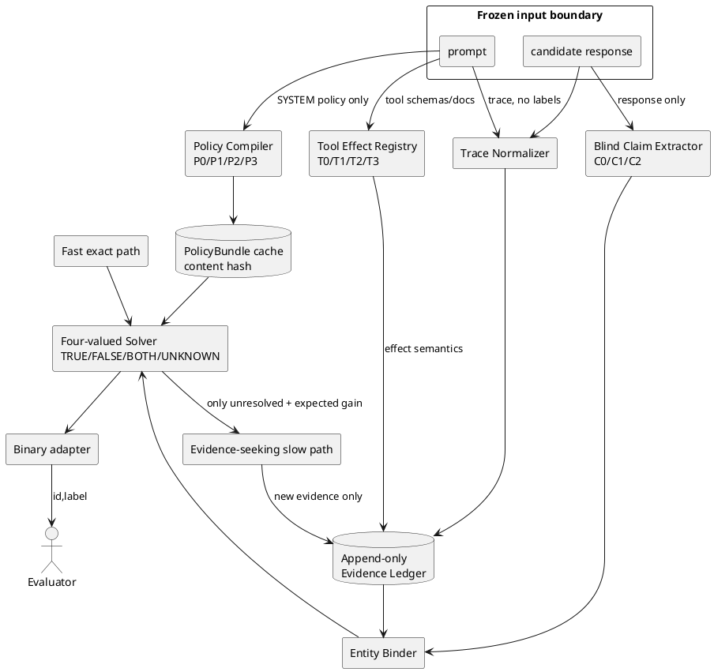

# Guardian Next: Compiled Evidential Monitor

## Решение

Базовая гипотеза — не просить одну LLM сразу выдать метку, а разделить задачу на
типизированные предложения и детерминированную проверку. LLM допускается только
как компилятор или экстрактор кандидатов. Она не превращает свою интерпретацию в
факт и не видит `label`/`explanation`.

Текущий минимальный arm `X5_PROPOSED_MIN` реализован рядом с V5.3 в
`guardian_truth.next`; V5.3 не изменён. Frozen internal/external прогоны не
показали прироста X5, поэтому production-победителем остался X0/V5.3, а эта
схема сохраняется только как проверенный shadow-кандидат.

## Инварианты

- `USER_ACTION != ASSISTANT_ACTION`.
- `INTENT != COMPLETED`, `CLAIM != OBSERVED`.
- `CALL_ATTEMPTED != EFFECT_CONFIRMED`.
- `FAILED` не означает ни `COMPLETED`, ни `NO_EFFECT` без контракта.
- `not found != absent`; отсутствие требует сертификата полноты.
- `UNKNOWN != FALSE`; противоречие сохраняется как `BOTH`.
- одинаковый тип поля не означает одинаковую сущность.
- старое наблюдение не становится текущим автоматически.
- имя инструмента и схема его аргументов не доказывают эффект.
- вывод LLM всегда остаётся интерпретацией до проверки решателем.

## Реализованный минимальный путь

1. `policy.compile_policy` сегментирует весь SYSTEM-текст, каждому сегменту
   назначает явный coverage status, компилирует только узкие точные шаблоны и
   хеширует только policy context.
2. `normalize.normalize_trace` детерминированно разделяет текст, вызовы и
   результаты; `build_evidence` создаёт append-only записи.
3. `effects.schema_registry` строит T0-контракты без выдуманных эффектов.
4. `claims.extract_claims` видит только response и различает intent, completed
   action, refusal и absence.
5. `binder` не поддерживает completed action одной попыткой вызова и не
   поддерживает absence без completeness certificate.
6. `logic` реализует четырёхзначную логику; `monitor` сохраняет точные находки
   V5.3 как incumbent protection.
7. `python -m guardian_truth.next.evaluate <stage>` воспроизводит каждый срез.

## Что не прошло production gate

- P1/P2 дали лишь частично валидный двухслучайный live smoke; P3 не прошёл
  transport gate. P4–P6 остались offline-механизмами без quality claim.
- T1 имеет только семь high-confidence контрактов; T2/T3 не оправданы без
  измеренного ceiling gain.
- C1/C2 не достигли надёжного покрытия/валидации; C0 покрывает 5.33% spans.
- X4 и X5 совпали с X0; X1 оказался слишком большим, X3 не прошёл citation
  validation, поэтому prerequisite для X6 отсутствует.
- L0/L2 сохранили evidence, L1 top-k был отвергнут из-за silent omission.
- External run выполнен, но trajectory reward не эквивалентен turn-localized
  Guardian labels; независимый совместимый gold остаётся отсутствующим.

Любая отсутствующая часть обозначается в machine-readable отчётах как
`unavailable`/`not_run`, а не заполняется предполагаемыми результатами.
