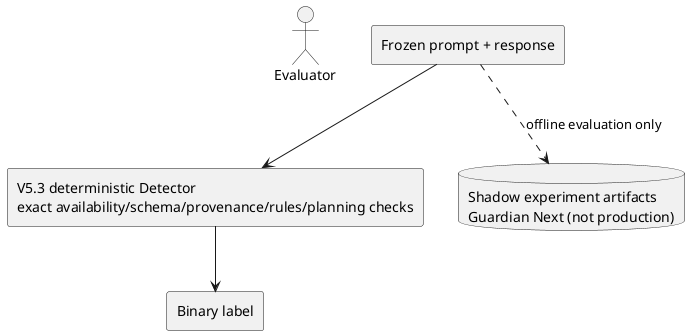

# Final decision

WINNER: `X0_CURRENT_V5_3` remains the production choice.

WHY: it is the simplest arm with reproduced quality. `X4_VIGIL_LIKE` and
`X5_PROPOSED_MIN` preserve its exact positives and soundness boundaries but add
no true positives on the 46-row development sample. Model-dependent arms did
not pass their transport, schema, coverage, and reliability gates.

BLIND RESULT: the frozen external run evaluated 144 recorded trajectories from
ATFD/tau-bench and 288 detector predictions. X0 and X5 were identical:
TP=0, FP=0, FN=83, TN=61. These are trajectory-success proxy labels, not
turn-localized Guardian error labels, so they are diagnostic OOD evidence and
must not be pooled with the internal score. ToolSandbox and BFCL were evaluated
only as unlabeled schema diagnostics.

SOUNDNESS REGRESSIONS: none in 511 automated tests, including metamorphic
role/intent/effect/absence/entity/freshness boundaries. This is test evidence,
not a population-level guarantee.

CONFIDENT-WRONG: FP=0 on the 46-row development sample and FP=0 against the
external trajectory proxy. Both samples are too small or label-misaligned to
justify a universal zero-FP claim.

UNRESOLVED: the internal sample still has 11 FN; P0 leaves 518/523 unique policy
segments UNKNOWN; C0 covers only 5.33% of audited response spans. The full
16-case semantic run was heavily rate-limited and no model arm beat P0.

COST: the retained production arm is deterministic and makes no API calls.
Live provider calls were bounded capability/contract probes. Exact monetary
cost is unavailable where providers did not return trustworthy billing usage.

WHAT WAS REJECTED:

- X4 and X5 as production replacements: zero measured gain over X0.
- L1 runtime top-k as the only long-policy input: all-required evidence recall
  0 and silent omission rate 1.0 in the controlled assembly test.
- X1 on current Groq route: representative full input was rejected as too large.
- X3 as currently prompted: compaction fixed transport, but the returned answer
  failed exact local citation validation.
- C1 and P1/P2/P3 for production: incomplete validation/transport reliability;
  P1 reached 1/16 exact, P2 and P3 reached 0/16.
- Mistral and Cerebras for this cycle: no successful generation under the
  frozen probes. NVIDIA DeepSeek/Kimi completed only 2/4 role probes each;
  NVIDIA Gemma completed 0/4; TokenHarbor transported 1/1 but validated 0/1.
- X6: not built, because its prerequisite conditional gain was absent.

WHAT REMAINS UNSOLVED: policy semantic coverage, robust typed citations,
high-recall blind claims, evidence-backed tool effects beyond the seven reviewed
contracts, and a genuinely independent turn-localized external gold set.

## Retained architecture

Guardian Next remains a shadow research architecture. Promotion requires a
pre-frozen candidate to preserve incumbent exact positives and then show a
positive paired gain on independent, label-compatible data.
